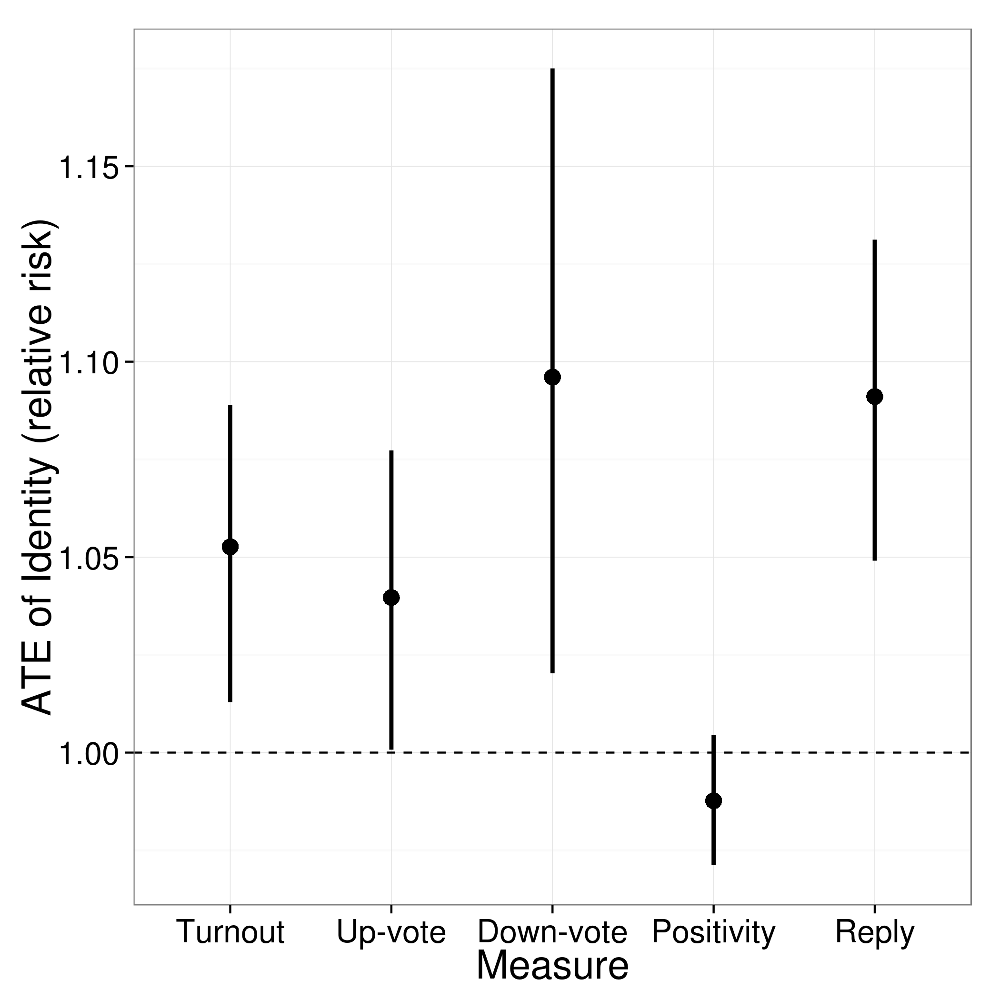

# Identity and Opinion: 

## A Randomized Experiment

Sean J. Taylor (NYU), Lev Muchnik (HUJI), and Sinan Aral (MIT)

# Identity and Opinion:

## A Randomized Experiment

Sean J. Taylor (NYU), Lev Muchnik (HUJI), and Sinan Aral (MIT)

# Identity and Opinion:

## A Randomized Experiment

# Identity and Content are Tied

## What makes social media <em>social</em>

Twitter

<small>(18% of online adults, Pew 2013)</small>

Reddit

<small>(6% of online adults, Pew 2013)</small>

Facebook

<small>(665m daily active users, Facebook 2013)</small>

Pinterest

<small>(70m users, Semiocast 2013)</small>

## Identity Cues

* are pervasive
* provide quality signal
* have a learned meaning/association over time
* affect our evaluation of content?

## How Valuable is an Identity?

1. more favorable ratings?
2. higher rate of engagement, response, or sharing?
3. NOT the same as audience size

## Identity and Content are Endogenous

## Related Work

* measuring user content quality (Agichtein et al. 2008)
* measuring sharer reputation (Yang et al. 2013)
* source effects in evaluation of social media (Messing 2013)
* economic value of online reputation (Resnick et al. 2002)
* causal effect of social cues (Bakshy et al. 2012, Muchnik et al. 2013)

## Field Experiment

### Social news website (similar to Reddit)

## Comments on posted articles

* ~ 2 years on a social news website
* ~ 3,700 commenters
* ~ 6,700 comment viewers
* ~ 3.5 x 105 comments
* ~ 1.7 x 107 comment exposures

## Conditions

  

    
    
<em>identified author</em>

    
<small>95% of viewer-comment exposures</small>

  

  

  
  
<em>anonymous author</em>

  
<small>5% of viewer-comment exposures</small>

  

Users were informed this was a site-wide experiment.

Two year study allows us to rule out novelty effects.

## Content Interactions

Comment rating is anonymous, ruling out reciprocity/retribution effects

## Measures

* <strong>Turnout rate</strong>: either up-vote or down-vote
* <strong>Up-vote rate</strong>
* <strong>Down-vote rate</strong>
* <strong>Positivity</strong> (<em>opinion change</em>): up-vote given turnout 
* <strong>Reply rate</strong>

## Experiment Design

## Model

`\( \Pr(Y_{ijk} = 1| D_{jk}) \sim \alpha_{ij} + \delta_{ij} D_{jk}  \)`

* $Y_{ijk}$ &mdash; 1 if the viewer $k$ interacts with $i$'s comment $k$
* $D_{jk}$ &mdash; viewer $j$ sees commenter for comment $k$
* $i$ &mdash; commenter
* $j$ &mdash; viewer
* $k$ &mdash; comment

## ATE of Identity

`ATEI = \( \frac{\Pr(Y_{ijk} = 1 | D_{jk} = 1)}{\Pr(Y_{ijk} = 1 | D_{jk} = 0)} \)`

## Conditional ATE of Identity

`ATEI(x) = \( \frac{\Pr(Y_{ijk} = 1 | D_{jk} = 1, X_{ijk} = x)}{\Pr(Y_{ijk} = 1 | D_{jk} = 0, X_{ijk} = x)} \)`

## Average Treatment Effects

<small>Bootstrap 95% Confidence Intervals for Relative Risk</small>

## Commenter-level Effects

<small>Comments are highly skewed toward active users, allowing a within-subject analysis.</small>

<small>Active commenters seem to mostly be helped by their identities.</small>

<small>Dramatic positive opinion change for some active users.</small>

<small>Higher reply rates for some commenters when identity is shown.</small>

# Hypotheses

1. new vs. old users
2. articulated relationship
3. accumulating (dis)advantage

## Uncertainty about identity

## Articulated Relationship

* friends
* enemies
* no relationship

## You are how you're rated?

Usually seen next to high scores &rarr; helpful identity.

Usually seen next to low scores &rarr; harmful identity.

## New users

## New vs old viewers

<small>New viewer subgroup: 4.6x10^5 exposures</small>

## New vs old commenters

<small>New commenter subgroup: 4.9x10^5 exposures</small>

## Articulated Relationship

## Influence of Prior Score Cues

## Influence of Prior Score Cues

## Influence of Prior Score Cues

## Findings

1. rating and reply behavior are altered by identity
2. for active commenters, identity seems to improve ratings
3. new users creating accounts out of spite?
4. tenured users strongly biased against new users
5. strong identity effects for users with articulated relationships
6. associated bad scores hurt ratings, good scores help replies

<strong>A mechanism for cumulative advantage in ratings?</strong>
